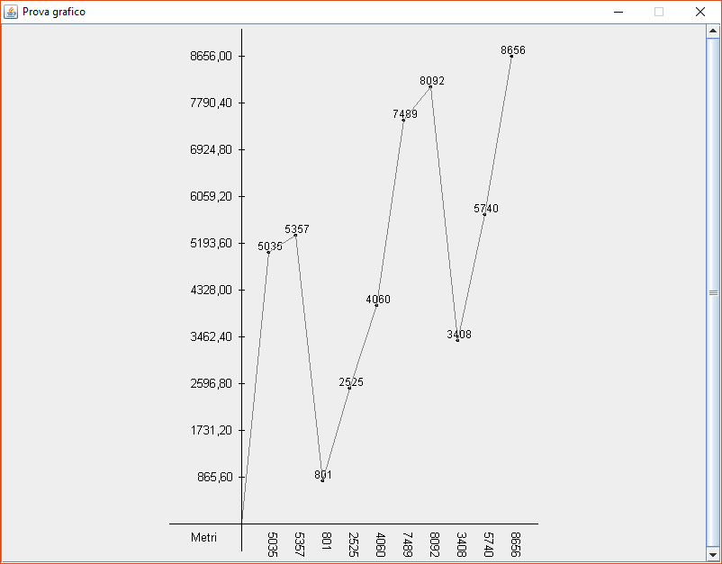
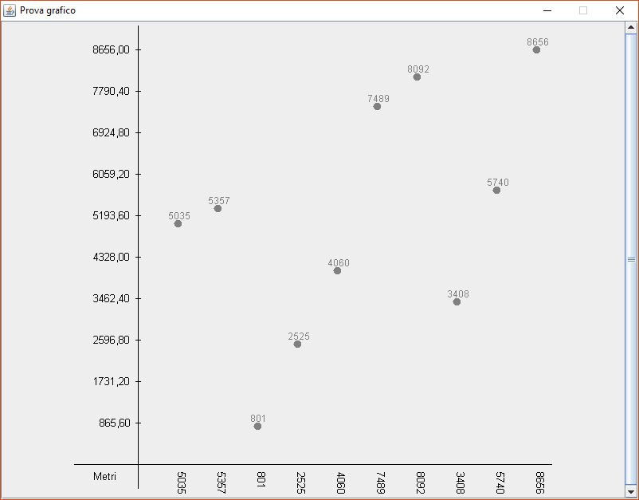
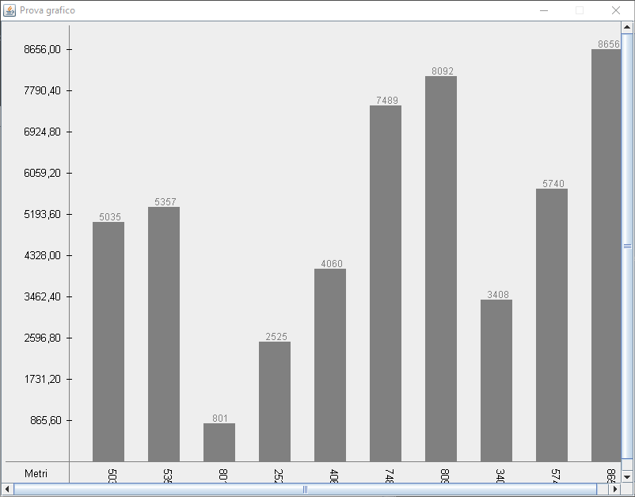
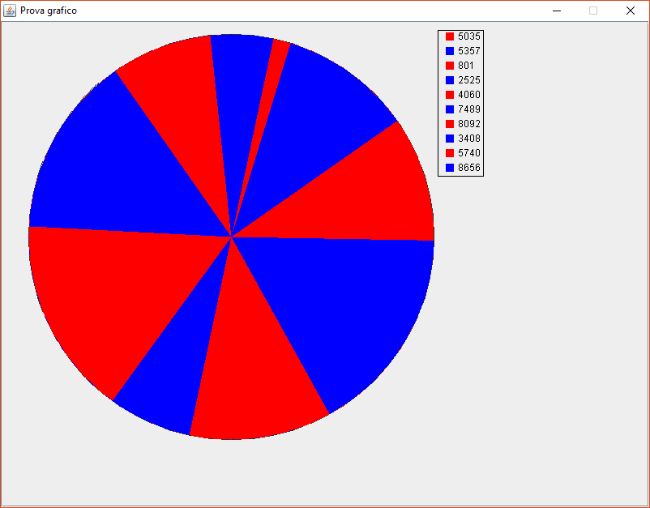

# JavaChart
Project for Object-Oriented Programming course, a.a. 2017/2018

## How to use
Simply download `src/main` folder into your src project folder.

Make sure to implement the [Drawable][dr] interface in the class that represents your data.

Then create a [DataTable][dt] object to store all of your data and use it's method to create graphs!

See [`Test`][t] file for a complete example

### Usage
First of all create a DataTable object and insert some data

		DataTable< CLASS implements Drawable > dt = new DataTable<>(TITLE, UNIT);
		dt.insert(new CLASS(..));	

Now create charts based on these data in 3 way:

* Create utomatically a JFrame (800x600) with title passed as an argument in DataTable object constructor

		dt.createDiagram(DataTable.graphicTypes._TYPE_);
		
* Create a JFrame in the program (custom options) and pass it as an argument to DataTable method

		JFrame ciccio = new JFrame(TITLE);
        dt.createDiagram(DataTable.graphicTypes._TYPE_, ciccio);
		
* Create automatically a JPanel object with custom dimension passed as an argument and include in custom JFrames

		JFrame pippo = new JFrame("Pippo");

        pippo.setContentPane(
                dt.createDiagram(DataTable.graphicTypes._TYPE_, pippo.getSize())
        );

	
## Types of charts

**Line Diagram**

**Point Diagram**

**Histogram**

**Pie Chart**

---

Project made with [Aledark9730](https://github.com/Aledark9730)

[dr]: src/javaplot/Drawable.java
[dt]: src/javaplot/graphs/DataTable.java
[t]: src/test/Test.java